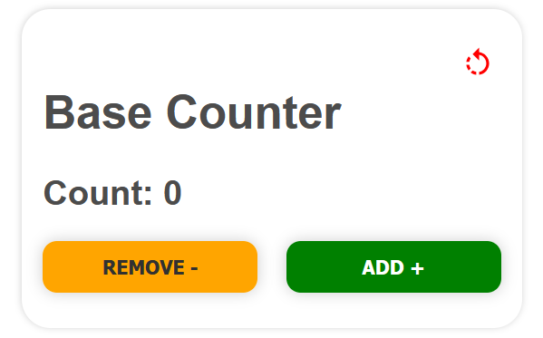

# React-counter-app

Это базовый счетчик на основе react + vite с использованием useState
Данный счетчик показывает возможности использовать хук useState и в дополнении,
структура компонентов позволяет переиспользовать компоненты, такие как Button или Text
в различных участках, передавая разные props.

